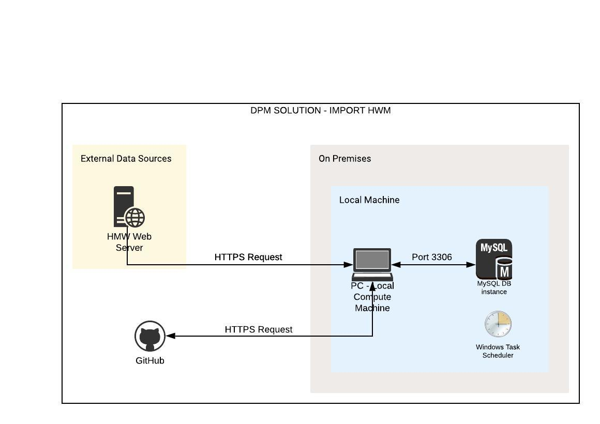
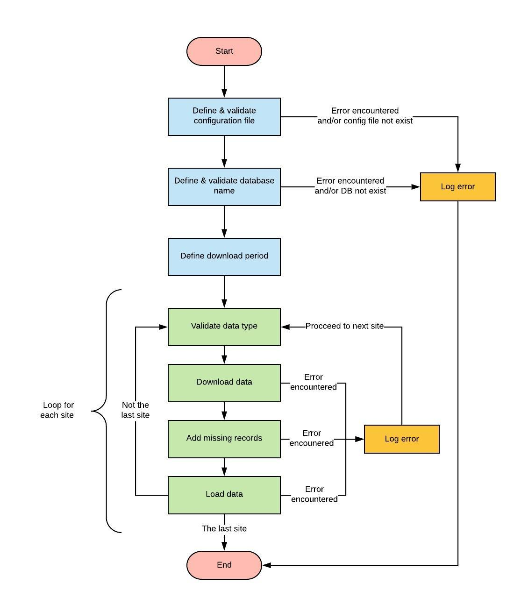
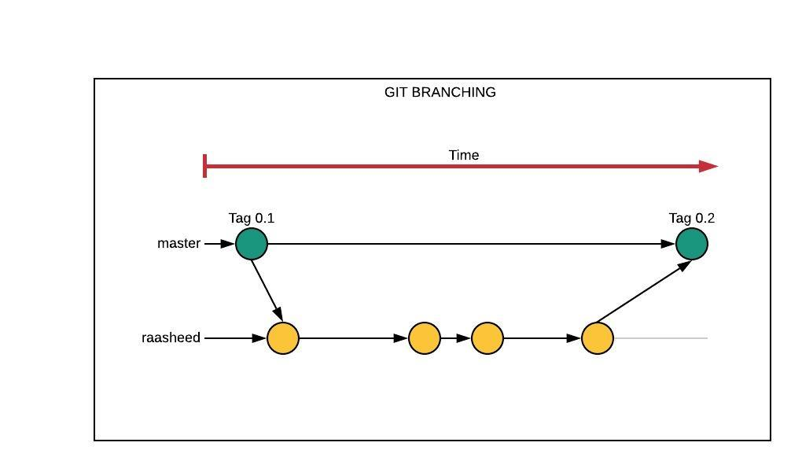

## Table of Contents
* [General Info](#General-Info)
* [Technologies](#Technologies)
* [Setup](#Setup)
* [Executing The Pipeline](#Executing-The-Pipeline)
* [Design](#Design)
* [Git Info](#Git-Info)

## General Info
This project is data pipeline which part of SME Water - DPM Solution. The pipeline is broken down into the following processes:
* Pull data from HWM web server into local via HTTP request.
* Re-fill missing records.
* Load data into local database (MySQL).
* Push data out from local database (MySQL) into a txt file. The output files are used by Tableau for visualization purpose.

## Technologies
* Python: 3.7
* MySQL Workbench 8.0 CE
* MySQL Server
* Tableau Public 2019.4 (Desktop)
* Github
	
## Setup
To run this locally or on a VM please follow the following steps:
* Install Python 3.7
* Install Git
* Clone the project
```
git clone https://github.com/lydiarosalia/sme-water-dpm-solution.git
```

* Install all the python requirements
```
cd import-hwm
pip install -r requirements.txt
```

## Executing The Pipeline
### Runtime Arguments
Runtime arguments: the name of configuration file that will be used and database name
* Configuration file - If no argument is provided, then it will use default configuration file (see projectconfig.ini). If argument is provided, then it will use provided configuration file.
* Database Name - If no argument is provided, then it will load into default database (see projectconfig.ini). If argument is provided, then it will load into that database.
  
### Running Locally or on a VM
To run the pipeline locally:
* Complete [Setup](#setup).
* Execute `run_locally.py` with argument `--configfile` and  `--dbname`.

Syntax:
```
python run_locally.py --configfile {filename} --dbname {dbname}
```
Example: to run data pipeline using configuration file named test_config.csv and load into test-db database
```
python run_locally.py --configfile test_config.csv --dbname test-db
```

### Syntax for The .bat File
The .bat file will contain the following syntax.

Syntax:
```
"{path of your python.exe}" "{path of run_locally.py}" --configfile {configuration file name} --dbname {database name}
```
Example: to run data pipeline using configuration file named test_config.csv and load into test-db database
```
"C:/ProgramData/Anaconda3/python.exe" "C:/sme-water-dpm-solution/import-hwm/run_locally.py" --configfile test_config.csv --dbname test-db
```

## Design
### High Level Design
The high level overview of how the data move within the pipeline.



### High Level Process Flow


### Error Handling
|Error Summary|Description|
|----------|-----------|
|Missing configuration file| Error caused by configuration file (CSV file which contain the list of sites) is not found in /utils directory. If encounter this error, then the process will be terminated, error message displayed and logged into log file.|
|Database is not exist| Error caused by the database is not found in local MySQL instance. If encounter this error, then the process will be terminated, error message displayed and logged into log file.|
|Invalid data type| Error caused by incorrect data type. Valid data types are "flow" or "pressure". If encounter this error, it will be logged into log file, the process will still continue.|
|Error during file download| Any error that is encountered when downloading a file will be logged into log file, the process will still continue.|
|Error during adding missing record process| Any error that is encountered when processing missing record will be logged into log file, the process will still continue.|
|Database error during data load| Any DB error that is encountered when loading data will be logged into log file, the process will still continue.|


## Git Info
### Branching

