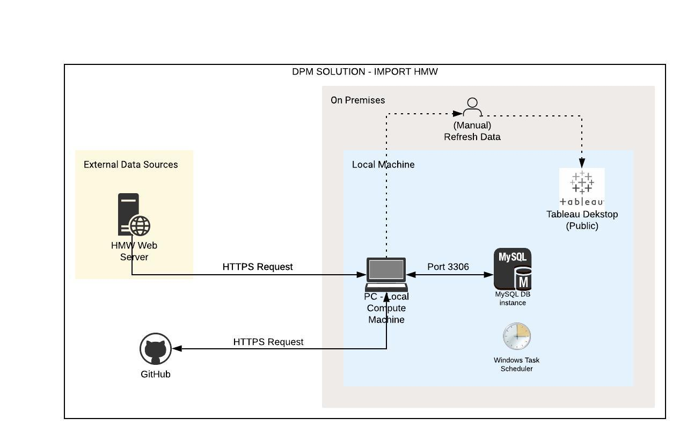

## Table of Contents
* [General Info](#General-Info)
* [Technologies](#Technologies)
* [Setup](#Setup)
* [Executing The Pipeline](#Executing-The-Pipeline)
* [Design](#Design)
* [Git Info](#Git-Info)

## General Info
This project is data pipeline which part of SME Water - DPM Solution. The pipeline is broken down into the following processes:
* Pull data from HMW web server into local via HTTP request.
* Load data into local database (MySQL).
* Push data out from local database (MySQL) into a txt file. The output files are used by Tableau for visualization purpose.

## Technologies
* Python: 3.7
* MySQL Workbench 8.0 CE
* MySQL Server
* Tableau Public 2019.4 (Desktop)
* Github
	
## Setup
To run this locally or on a VM please follow the following steps:
* Install Python 3.7
* Install Git
* Clone the project
```
git clone https://github.com/lydiarosalia/sme-water-dpm-solution.git
```

* Install all the python requirements
```
cd import-hmw
pip install -r requirements.txt
```

## Executing The Pipeline
### Runtime Argument
Runtime argument = the name of configuration file that will be used.
The file must be located in /utils directory.

* If no argument is provided, then it will use default configuration file.
* If argument is provided, then it will use provided configuration file.
  
### Running Locally or on a VM
To run the pipeline locally:
* Complete [Setup](#setup).
* Execute `run_locally.py` with argument `--configfile`
Syntax:
```
python run_locally.py --configfile [{filename}.csv]
```
Example: to run BAU data pipeline (using default configuration file)
```
python run_locally.py
```
Example: to run adhoc data pipeline (using adhoc configuration file named adhoc_config.csv)
```
python run_locally.py --configfile adhoc_config.csv
```
## Design
### High Level Design
The high level overview of how the data move within the pipeline.



### Lower Level Design
The detail overview of how the data move within the pipeline, include the business logics.

### Error Handling
???

## Git Info
### Branching

